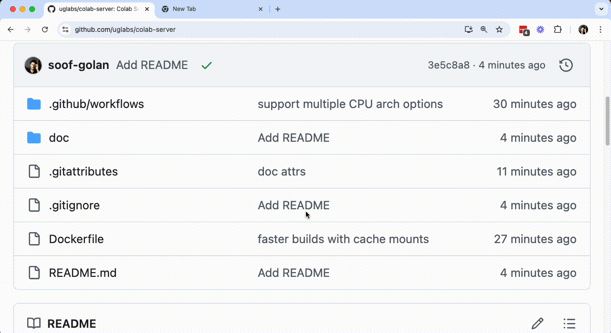

# UG'g Public Colab Server

## To Run

Install [Docker Desktop](https://www.docker.com/products/docker-desktop) and run the following command:

```bash
docker run --rm -it -p 9876:9876 ghcr.io/uglabs/colab-server:main
```

Go to [Google Colab](https://colab.research.google.com/) and connect to the local runtime


